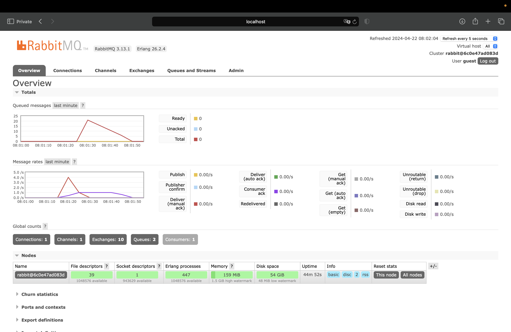

## REFLEKSI 1
###### 1. what is amqp? 
AMQP (Advanced Message Queuing Protocol) adalah sebuah protokol lapisan aplikasi standar terbuka yang digunakan untuk middleware berorientasi pesan. Protokol ini memungkinkan berbagai aplikasi untuk berkomunikasi satu sama lain dengan bertukar pesan secara efisien. AMQP menyediakan cara untuk mengirim, menerima, dan memproses pesan, serta memastikan pesan tersebut dapat diandalkan dan efisien dalam distribusi.

###### 2. what it means? guest:guest@localhost:5672 , what is the first quest, and what is 
the second guest, and what is localhost:5672 is for? 
- String guest:guest@localhost:5672 adalah URL koneksi ke server AMQP.
- guest:guest adalah nama pengguna dan kata sandi yang digunakan untuk otentikasi pada server. Dalam kasus ini, baik nama pengguna maupun kata sandi keduanya adalah "guest".
- @localhost:5672 menunjukkan host dan port. "localhost" menunjukkan bahwa server RabbitMQ berjalan di mesin yang sama dengan kode yang terhubung. Port 5672 adalah port default yang digunakan oleh RabbitMQ untuk komunikasi AMQP.

###### Simulation slow subscriber

###### why the total number of queue is as such (in my machine is 20, what about yours?)
Ketika saya menjalankan cargo run sebanyak 5 kali pada publisher dengan cepat, grafik menunjukkan bahwa queue mencapai 20. Ini disebabkan karena sleep dalam program. Jadi, terdapat 20 messages dalam antrian yang menunggu di consume.